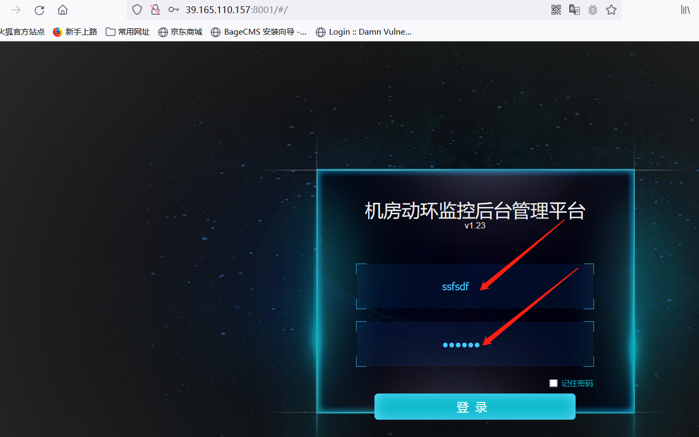

Vulnerability type
There are logical defects and loopholes in the moving ring monitoring background system of Guangzhou Kingston Electronic Technology Co., Ltd.

Impact version
Machine room dynamic environment monitoring background management platform v1 two
Machine room dynamic environment monitoring background management platform v1 twenty-two
Machine room dynamic environment monitoring background management platform v1 twenty-three

Give several websites with vulnerabilities,
http://39.165.110.157:8001/#/ , http://222.136.105.244:8000/#/ , http://121.33.236.36:8089/#/ , http://124.115.106.234:8123/#/ , http://61.142.3.58:8089/#/ , http://61.145.178.248:8010/#/ , http://59.36.14.108:8089/ , http://58.255.35.25:8089/ , http://221.209.10.62:8008/#/ , http://183.234.255.60:8000/#/

Utilization process

